# DRL Solver for the Time-Dependent Travelling Salesman Problem

> **Master's Thesis** - Anuradha Dissanayake  
> University of Hildesheim, Germany · Supervisor: Prof. Dr. Dr. Lars Schmidt-Thieme, Tim Dernedde

A Deep Reinforcement Learning framework for solving the **deterministic Time-Dependent Travelling Salesman Problem (TDTSP)** with a fixed customer set. Built on top of the M1 attention-based encoder-decoder of Zhang et al. (2023), this work introduces three architectural extensions — **Step-Aware Decoder (Step-MLP / Temp-MLP)**, **Cost-Aware Gating**, and **Time-Sliced Traffic Encoding with Safe Refresh** — evaluated on real-world Beijing traffic data at customer set sizes C = 19 and C = 49.

<p align="center">
  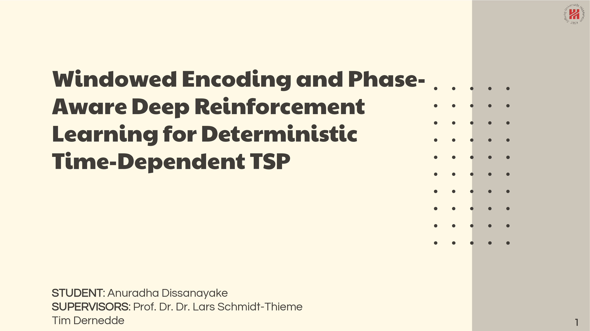
</p>

---

## Table of Contents

- [Problem Setting & MDP Framework](#problem-setting--mdp-framework)
- [Research Gaps & Contributions](#research-gaps--contributions)
- [Architecture Overview](#architecture-overview)
- [Model Variants](#model-variants)
- [Results](#results)
  - [Step-MLP & Decoder Variants](#step-mlp--decoder-variants)
  - [Cost-Aware Gating](#cost-aware-gating-results)
  - [Time Slicing with Safe Refresh](#time-slicing-with-safe-refresh-results)
  - [Comparison with Classical Heuristics](#comparison-with-classical-heuristics)
- [Repository Structure](#repository-structure)
- [Installation](#installation)
- [Usage](#usage)
- [Hyperparameter Reference](#hyperparameter-reference)
- [Citation](#citation)
- [Acknowledgements](#acknowledgements)
- [License](#license)

---

## Problem Setting & MDP Framework

Classical TSP solvers assume static, symmetric travel costs. In practice, travel times between locations vary throughout the day due to traffic congestion, rush hours, and other factors. This work targets the **deterministic TDTSP with a fixed customer set**, where edge costs are continuous functions of departure time:

$$\min_\pi \sum_{k=0}^{n} d_{\pi_k, \pi_{k+1}}\!\left(t_{\pi_k}\right)$$

Travel times are represented via **cubic spline interpolation** over 12 two-hour bins per edge, fitted to real Beijing traffic data collected by Jingdong Logistics. The dataset covers 100 locations (including depot), with 10,000 ordered city pairs. The **FIFO property** (leaving later cannot result in arriving earlier) is satisfied by the real-world data and preserved by the spline smoothing.

<p align="center">
  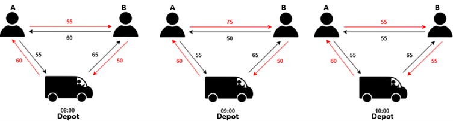
</p>

### MDP Formulation

The routing problem is cast as a **Markov Decision Process (MDP)** solved by a neural agent. At each decision step, the agent observes the full state and selects the next customer to visit. The tour is built autoregressively until all customers are visited and the agent returns to the depot.

<p align="center">
  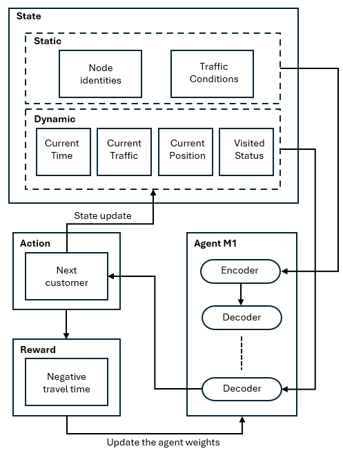
</p>

| Component | Definition |
|---|---|
| **State** | *Static:* node identities, cubic spline traffic coefficients. *Dynamic:* current position, current time, current traffic condition, visited mask |
| **Action** | Select next unvisited customer node |
| **Reward** | Negative total tour travel time |
| **Policy** | Encoder-decoder attention model, trained with REINFORCE + rollout baseline |

The state is split into **static** attributes (known at episode start and unchanged throughout) and **dynamic** attributes (updated after every action). The encoder processes static features once per episode (or per time window under time slicing), while the decoder queries dynamic state at every step.

---

## Research Gaps & Contributions

The M1 baseline (Zhang et al., 2023) has three architectural gaps that this thesis addresses:

### Gap 1 - No Tour-Progress Awareness in the Decoder

The M1 decoder receives the graph embedding, depot embedding, visited mask, last-visited node, and current traffic — but has no explicit signal for how far through the tour it has progressed. Early-tour decisions (anticipating afternoon congestion) and late-tour decisions (declining congestion) require fundamentally different reasoning.

**Contribution: Step-Aware Decoder via Step-MLP and Temp-MLP**

A lightweight MLP injected into the decoder receives tour-progress features and outputs either a **context nudge** (added to the decoder query) or a **learned temperature** that scales the attention logits. The best-performing feature set (`v2_light`) uses: step ratio, linear time encoding, depot distance, cumulative tour length, and mean distance to unvisited nodes.

Four decoder variants are evaluated:

| Variant | Position | What it does |
|---|---|---|
| **Step-MLP** | Pre-attention | Adds a context nudge to the decoder query |
| **Option A** | Post-attention | MLP refinement of the glimpse vector after attention |
| **Option C** | Pre-attention | MLP applied to the full context vector before attention |
| **Temp-MLP** | Post-attention | Learns a temperature scalar that scales the attention logits |

### Gap 2 - No Classical Heuristic Knowledge in the Decoder

Neural routing models learn purely from reward signal and ignore decades of knowledge encoded in classical heuristics (nearest-neighbour, greedy edge, etc.).

**Contribution: Cost-Aware Gating**

Heuristic logits are blended into the attention logits via a learnable scalar $\lambda_{\text{heur}}$:

$$\ell_i^{\text{blended}} = \ell_i + \lambda_{\text{heur}} \cdot h_i(s_t)$$

Unlike prior work (ReLD, Huang et al. 2025) that uses static Euclidean distances, this mechanism uses **time-dependent travel costs** as the heuristic signal. Linear (nearest-neighbour), two-step lookahead (NN+1), and randomised NN (NNR) heuristics are supported. Both fixed and learnable λ are explored.

### Gap 3 - Encoder Consumes the Full 24-Hour Traffic Profile

The M1 encoder encodes the entire day's traffic matrix, most of which is irrelevant once the tour is underway. This wastes computation and dilutes attention on relevant future traffic.

**Contribution: Time-Sliced Traffic Encoding with Safe Refresh**

The encoder receives only a **forward time window** from the current decision time. A **safe refresh** mechanism re-encodes the traffic whenever the decoder's current time approaches or exceeds the window boundary, keeping the encoder's representation current throughout the tour.

### Bonus — Graph-Size-Independent Architecture

The original M1 model locks to a fixed graph size at training time. This thesis replaces the fixed-size visited-state and traffic embedding projections with **adaptive average pooling layers**, allowing a single trained model to generalise across customer set sizes without retraining. Quality degradation is at most **1.24%** relative to size-specific baselines.

---

## Architecture Overview

<p align="center">
  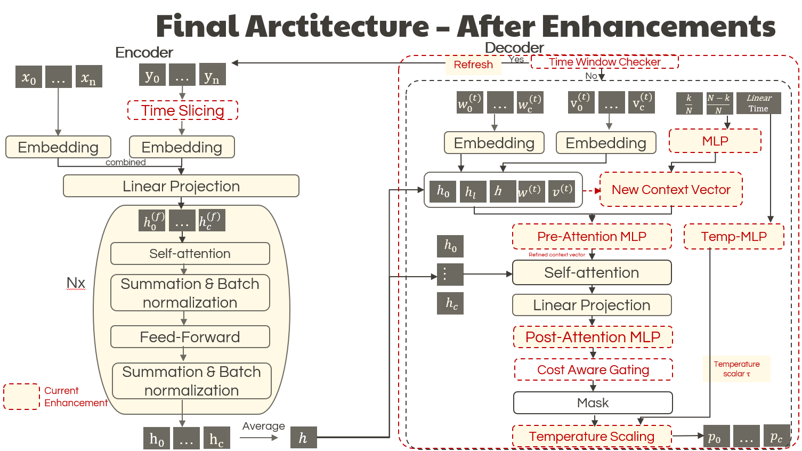
</p>

The **encoder** is a multi-head attention (MHA) transformer. Node features are one-hot encoded vectors of dimension 100 (the full location pool), processed through a linear projection and several MHA layers to produce per-node embeddings and a global graph embedding.

The **decoder** autoregressively selects the next city at each step using masked attention over unvisited nodes. The three extensions operate as follows:

- **Step-MLP / Temp-MLP**: inject tour-progress features at every decoder step
- **Cost-Aware Gating**: biases the final attention logits with a heuristic signal, scaled by λ
- **Time Slicing**: triggers encoder refresh at window boundaries, updating the graph representation mid-tour

The policy is trained with **REINFORCE + rollout baseline**. The baseline model is updated via a paired *t*-test at the end of each epoch. Three predefined random seeds (1234, 5678, 9012) are used; all reported results are averages across seeds.

---

## Model Variants

| Directory | Description |
|---|---|
| `m1/` | **Graph-independent** — node features do not include pairwise distance encoding. Faster, lower memory, supports cross-size generalisation via adaptive pooling. |
| `m1_graph_dependent/` | **Graph-dependent** — encoder receives the current distance matrix as additional node features. More expressive; requires fixed graph size unless adaptive pooling is applied. |
| `m2/` | Experimental M2 architecture (Zhang et al., 2023 baseline variant for dynamic customer pools). |

---

## Results

All neural model results are averaged across three random seeds (1234, 5678, 9012) unless stated otherwise. Greedy decoding is used for evaluation throughout.

### Step-MLP & Decoder Variants

The chart below shows the percentage improvement (lower is better — negative y = improvement) of each decoder MLP configuration over the M1 baseline, at both C = 19 (50 epochs) and C = 49 (100 epochs).

<p align="center">
  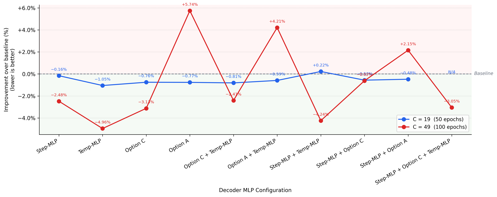
</p>

Key findings:
- **Temp-MLP** is the standout performer: **−1.05% at C = 19** and **−4.96% at C = 49** (lower cost = better).
- **Option A** (post-attention glimpse refinement) degrades performance at C = 49 (+5.74%), suggesting nonlinear glimpse transformation is harmful at scale.
- **Option C** alone performs well (+3.17% C=49 improvement), but combining variants consistently reduces gains.
- Combining any variant with Temp-MLP does not improve over Temp-MLP standalone.

Validation cost curves over 300 epochs confirm that Temp-MLP converges to a consistently lower cost than the baseline with smaller variance:

<p align="center">
  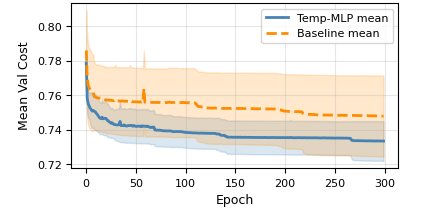
</p>

**C = 19 decoder variant results** (50 epochs, mean ± SD across 3 seeds):

| Configuration | Mean ± SD (min) |
|---|---|
| Baseline (M1) | 574.73 ± 10.78 |
| Step-MLP (v2_light) | 573.80 ± 7.22 |
| **Temp-MLP** | **568.68 ± 2.12** |
| Option C only | 570.32 ± — |
| Option A only | 570.39 ± — |
| Step-MLP + Option C | 571.48 ± — |
| Step-MLP + Option A | 571.96 ± — |

**C = 49 decoder variant results** (100 epochs, mean ± SD across 3 seeds):

| Configuration | Mean ± SD (min) |
|---|---|
| Baseline (M1) | 1095.93 ± 73.34 |
| **Temp-MLP** | **1041.57 ± 19.61** |
| Option C only | 1061.66 ± 37.11 |
| Option C + Temp-MLP | 1062.48 ± 25.23 |
| Step-MLP + Option C | 1089.12 ± 21.79 |
| Option A only | 1158.85 ± 67.26 |

---

### Cost-Aware Gating Results

The lambda sensitivity plot below shows mean test cost vs. gating weight λ for the nearest-neighbour (linear travel time) heuristic at C = 49. The optimal λ range is [0.25, 0.75].

<p align="center">
  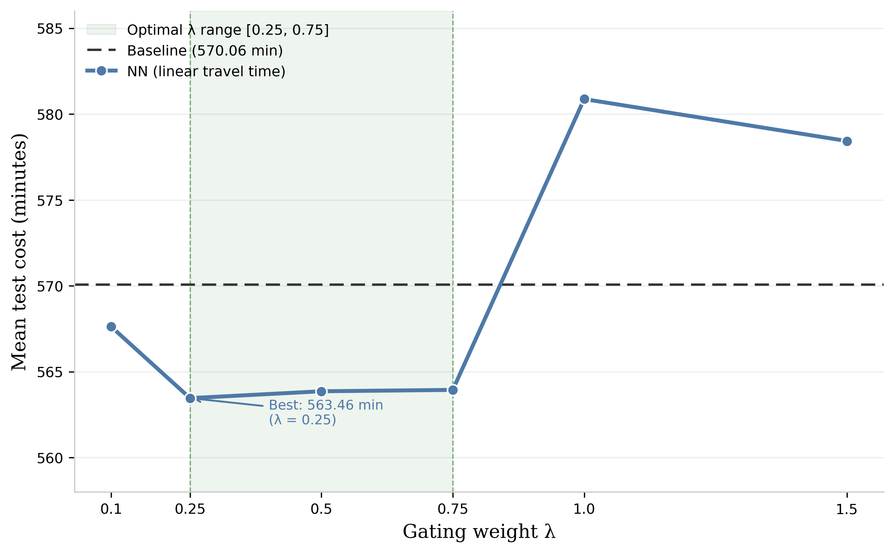
</p>

Key findings:
- At **C = 19**, cost-aware gating did **not** outperform the baseline in any tested configuration.
- At **C = 49**, standalone gating with **fixed λ = 0.25** and the linear NN heuristic achieves **1055.75 ± 25.14 min**, a **3.67% improvement** over baseline (1095.93 min).
- Fixed λ consistently outperforms learnable λ at C = 19.
- Combining cost-aware gating with Step-MLP or other decoder variants **degrades performance** in all tested combinations.

**C = 49 cost-aware gating results** (100 epochs, mean ± SD):

| Configuration | Mean ± SD (min) |
|---|---|
| Baseline (M1) | 1095.93 ± 73.34 |
| **Cost-Aware (NN, λ=0.25)** | **1055.75 ± 25.14** |
| Step-MLP v2_light | 1068.77 ± 22.60 |
| Step-MLP v2_light + Cost-Aware | 1091.52 ± 57.20 |

---

### Time Slicing with Safe Refresh Results

**Window size sensitivity** — optimal window size W varies with graph size. At C = 19 all windows are worse than no-slicing baseline; the mechanism shows clear benefit from C = 20 upward.

<p align="center">
  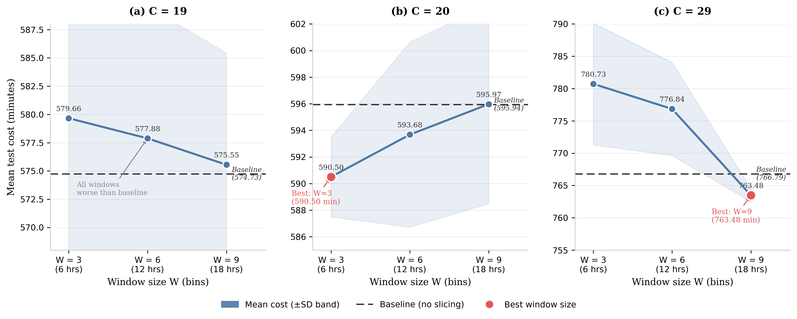
</p>

**Time slicing summary** across graph sizes — optimal W, cost improvement with one-time refresh, and optimal start time bin:

<p align="center">
  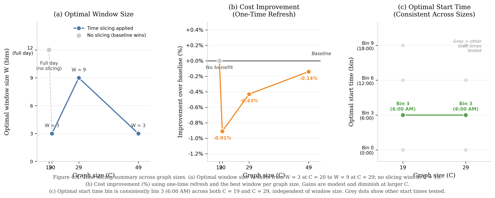
</p>

**Training time vs. cost trade-off** across all graph sizes — arrows show the direction of change from baseline (circle) to best time-sliced configuration (square):

<p align="center">
  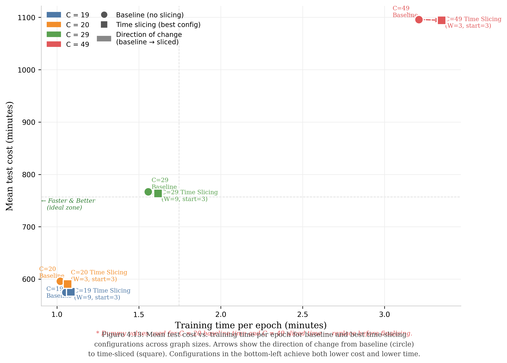
</p>

Key findings:
- Time slicing adds training overhead (~2.5% at C = 19, ~10.7% at C = 49) but consistently improves solution quality (+0.38% at C = 19, +1.19% at C = 49).
- Best configurations: **W = 9, start = bin 3** at C = 19; **W = 3, start = bin 3** at C = 49. Optimal start time (bin 3 = 06:00) is consistent across all tested graph sizes.
- Periodic refresh (interval = 0.25) generally outperforms one-time refresh.
- Combining Temp-MLP + Time Slicing achieves **2.94% improvement** and the **lowest variance** of any configuration (±6.47 min), but does not outperform Temp-MLP standalone.

---

### Comparison with Classical Heuristics

All neural models are compared against five classical heuristics evaluated on identical test instances using the same cubic spline travel time model.

**C = 19** (100 epochs for neural models):

| Model / Heuristic | Mean ± SD (min) | Time per Instance |
|---|---|---|
| ***Neural Models*** | | |
| **Temp-MLP** | **568.68 ± 2.12** | 0.36 ms |
| Time Slicing (W=9, start=3) | 572.55 ± 2.86 | 0.25 ms |
| Baseline (M1) | 565.50 ± 0.58 | 0.24 ms |
| ***Classical Heuristics*** | | |
| 2-opt | 575.65 ± 89.46 | 7,351.47 ms |
| Nearest Neighbour (NN) | 630.54 ± 105.49 | 9.80 ms |
| Greedy Edge | 633.71 ± 105.58 | 10.58 ms |
| NNR | 636.38 ± 101.28 | 94.58 ms |
| NN+1 | 648.86 ± 104.86 | 110.21 ms |

> Cost-Aware Gating is excluded from the C = 19 comparison as it did not outperform the baseline at this scale.

**C = 49** (100 epochs for neural models):

| Model / Heuristic | Mean ± SD (min) | Time per Instance |
|---|---|---|
| ***Neural Models*** | | |
| **Temp-MLP** | **1041.57 ± 19.61** | 0.94 ms |
| Cost-Aware (NN, λ=0.25) | 1055.75 ± 25.14 | 6.05 ms |
| Time Slicing (W=3, start=3) | 1082.81 ± 26.19 | 0.65 ms |
| Baseline (M1) | 1095.93 ± 73.34 | 0.64 ms |
| ***Classical Heuristics*** | | |
| 2-opt | 1117.61 ± 91.79 | 91,349.73 ms |
| Greedy Edge | 1154.21 ± 86.93 | 27.59 ms |
| Nearest Neighbour (NN) | 1168.03 ± 100.46 | 23.83 ms |
| NN+1 | 1201.84 ± 96.65 | 630.93 ms |
| NNR | 1211.52 ± 93.24 | 250.65 ms |

**Summary of neural vs. heuristic advantage:**
- At C = 19: Temp-MLP outperforms 2-opt by ~7 min while running **~20,000× faster**.
- At C = 49: Temp-MLP outperforms 2-opt by **~76 min (6.8%)** while running **~97,000× faster**.
- All proposed extensions outperform every classical heuristic at C = 49.
- The neural advantage grows with problem size, confirming scalability of the DRL approach.

**Summary of all extensions vs. baseline:**

| Extension | C = 19 | C = 49 | Recommendation |
|---|---|---|---|
| **Temp-MLP** | −1.05% | −4.96% | ✅ Best single choice at both scales |
| **Cost-Aware Gating** (NN, λ=0.25) | no gain | −3.67% | ✅ For C ≥ 49; avoid at C = 19 |
| **Time Slicing** (W=9 / W=3) | −0.38% | −1.19% | ✅ Adds training overhead; improves quality |
| **Temp-MLP + Time Slicing** | −2.94% | — | ⚠️ Lowest variance; no gain over Temp-MLP alone |
| **Adaptive Pooling** | ≤+1.24% vs size-specific | — | ✅ Enables cross-size generalisation |

> **General rule:** individual components consistently outperform combinations. Ablate each component independently before combining.

---

## Repository Structure

```
DRLSolver4DTSPTimeSlicing/
│
├── m1/                              # Graph-independent model
│   ├── train.py                     # Training entry point
│   ├── test.py                      # Evaluation & model comparison
│   ├── transformer.py               # Encoder + decoder (attention model)
│   ├── options.py                   # All hyperparameters and flags
│   ├── baselines.py                 # REINFORCE baselines (rollout, EMA, warmup)
│   ├── heuristics.py                # NN, Greedy Edge, NNR, NN+1, 2-opt
│   ├── experiment_tracker.py        # CSV-based experiment logging
│   ├── evaluate_step_mlp.py         # Step-MLP ablation evaluation
│   ├── visualize_experiments.py     # Plot experiment results
│   └── analyze_time_slicing_experiments.py
│
├── m1_graph_dependent/              # Graph-dependent model (same interface as m1)
│   ├── ...                          # Same structure as m1
│   ├── eval_heuristics.py           # CPU heuristic evaluation
│   ├── eval_heuristics_GPU.py       # GPU heuristic evaluation
│   └── time_inference.py            # Inference timing benchmarks
│
├── m2/                              # Zhang et al. (2023) M2 baseline variant
│
├── data/
│   ├── node_19.txt                  # City coordinates (19-customer benchmark)
│   ├── node_49.txt                  # City coordinates (49-customer benchmark)
│   ├── valid_data_19.txt            # Validation instances (C = 19)
│   ├── valid_data_49.txt            # Validation instances (C = 49)
│   ├── valid_data_49_v2.txt         # Validation instances (C = 49, v2)
│   └── generate_node_dataset.py     # Dataset generation script
│
├── results/
│   ├── comparison/                  # Model comparison results (costs, routes, xlsx)
│   ├── heuristics/                  # Heuristic baseline costs and summaries
│   ├── validation/                  # Validation cost curves (CSV + plots)
│   ├── timing/                      # Inference timing benchmarks (xlsx)
│   └── logs/                        # Experiment tracking logs (CSV)
│
├── docs/
│   ├── Thesis_Report_Anuradha_Dissanayake.pdf
│   ├── PPT.pdf
│   ├── Anuradha_Dissanayake_Thesis_Proposal_V2.pdf
│   └── DECODER_DOCUMENTATION.docx
│
├── figures/                         # Architecture diagrams and result figures
├── scripts/
│   ├── check_torch_env.py
│   ├── plot_spline.py               # Visualise cubic spline travel time curves
│   └── test_direct_local.sh
│
├── requirements.txt
├── .gitignore
└── README.md
```

---

## Installation

**Requirements:** Python 3.8+, Windows or Linux, CUDA optional (DirectML supported on Windows)

```bash
# Clone the repository
git clone https://github.com/YOUR_USERNAME/DRLSolver4DTSPTimeSlicing.git
cd DRLSolver4DTSPTimeSlicing

# Create and activate a virtual environment
python -m venv .venv
# Windows:
.\.venv\Scripts\Activate.ps1
# Linux/macOS:
source .venv/bin/activate

# Install dependencies
pip install --upgrade pip
pip install -r requirements.txt
```

> **Windows GPU note:** The project uses `torch-directml` for GPU acceleration on Windows (AMD/Intel/NVIDIA via DirectML). On Linux with CUDA, replace `torch-directml` with the appropriate CUDA-enabled PyTorch wheel from [pytorch.org](https://pytorch.org/get-started/locally/).

All experiments in the thesis were run on an **NVIDIA GeForce RTX 2070 (8 GB)** using the university HPC cluster (STUD partition), 4 CPU cores per experiment.

---

## Usage

All commands below use `m1/` (graph-independent). Substitute `m1_graph_dependent/` for the graph-dependent variant.

### Training

**Baseline M1 (rollout baseline, C = 19, 100 epochs):**
```bash
python m1/train.py \
  --baseline rollout \
  --graph_size 19 \
  --n_epochs 100 \
  --run_name baseline_model
```

**With Temp-MLP (recommended extension):**
```bash
python m1/train.py \
  --baseline rollout --graph_size 19 --n_epochs 100 \
  --run_name temp_mlp \
  --use_step_mlp --step_mlp_type temp --step_mlp_dim 64
```

**With Cost-Aware Gating (recommended for C = 49):**
```bash
python m1/train.py \
  --baseline rollout --graph_size 49 --n_epochs 100 \
  --run_name gating_nn_fixed \
  --use_cost_aware_gating \
  --heuristic_type nearest_neighbor \
  --lambda_heuristic 0.25
```

**With Time Slicing (W = 3, periodic refresh, interval = 0.25):**
```bash
python m1/train.py \
  --baseline rollout --graph_size 49 --n_epochs 100 \
  --run_name time_slicing_w3 \
  --time_slicing --slicing_window 3 --refresh_interval 0.25
```

### Evaluation

**Evaluate a trained model:**
```bash
python m1/test.py \
  --load_path outputs/tsp_19/temp_mlp_<timestamp>/epoch-99.pt \
  --graph_size 19 --baseline rollout
```

**Compare two models side-by-side:**
```bash
python m1/test.py \
  --graph_size 19 --baseline rollout \
  --compare_models \
    outputs/tsp_19/baseline_<ts>/epoch-99.pt \
    outputs/tsp_19/temp_mlp_<ts>/epoch-99.pt \
  --compare_names "Baseline (M1)" "Temp-MLP"
```

**Run classical heuristic baselines:**
```bash
python m1_graph_dependent/eval_heuristics.py --graph_size 19
python m1_graph_dependent/eval_heuristics_GPU.py --graph_size 49
```

All runs are automatically logged to `outputs/tsp_<size>/<run_name>_<timestamp>/` and tracked in `experiment_log.csv`.

---

## Hyperparameter Reference

Selected values from thesis hyperparameter search (C = 20, 50 epochs, 3 seeds):

<p align="center">
  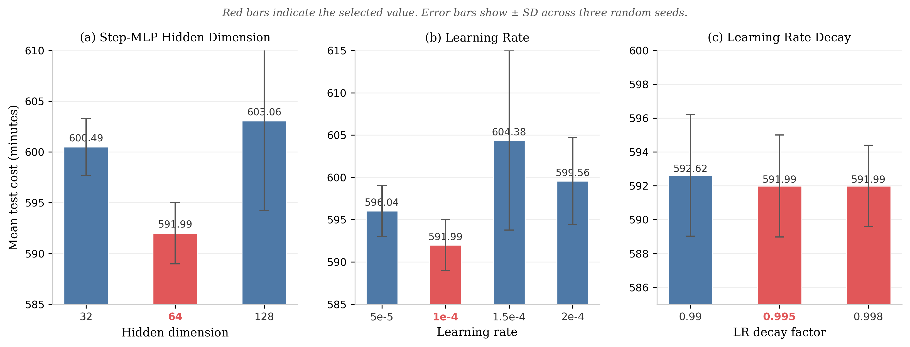
</p>

| Hyperparameter | Values Explored | Selected Value |
|---|---|---|
| Batch size | 32, 256, 512 | 256 |
| Epochs | 50, 100 | 50 (C=19/20), 100 (C=29/49) |
| Learning rate | 0.00005, 0.0001, 0.00015, 0.0002 | **0.0001** |
| LR decay | 0.99, 0.995, 0.998 | **0.995** |
| Step-MLP hidden dim | 32, 64, 128 | **64** |
| Random seeds | 1234, 5678, 9012 | All three (averaged) |

**Lambda sweep (Cost-Aware Gating):**
```bash
for lambda_val in 0.1 0.25 0.5 0.75 1.0 1.5; do
    python m1/train.py --baseline rollout --graph_size 49 --n_epochs 100 \
        --run_name gating_nn_lambda_${lambda_val} \
        --use_cost_aware_gating --heuristic_type nearest_neighbor \
        --lambda_heuristic ${lambda_val}
done
```

**Window size sweep (Time Slicing):**
```bash
for w in 3 6 9 12; do
    python m1/train.py --baseline rollout --graph_size 19 --n_epochs 50 \
        --run_name time_slicing_w${w} \
        --time_slicing --slicing_window ${w}
done
```

---

## Citation

If you use this code or build on this work, please cite:

**Thesis:**
```bibtex
@mastersthesis{dissanayake2026tdtsp,
  title   = {Solving the Deterministic Time-Dependent Travelling Salesman Problem
             with Deep Reinforcement Learning},
  author  = {Dissanayake, Anuradha},
  school  = {University of Hildesheim},
  year    = {2026}
}
```

**Baseline model this work extends (Zhang et al., 2023):**
```bibtex
@article{zhang2023solving,
  title     = {Solving Dynamic Traveling Salesman Problems With Deep Reinforcement Learning},
  author    = {Zhang, Zizhen and Liu, Hong and Zhou, MengChu and Wang, Jiahai},
  journal   = {IEEE Transactions on Neural Networks and Learning Systems},
  year      = {2023},
  publisher = {IEEE},
  doi       = {10.1109/TNNLS.2021.3105905}
}
```

**Attention Model (Kool et al., 2019):**
```bibtex
@inproceedings{kool2019attention,
  title     = {Attention, Learn to Solve Routing Problems!},
  author    = {Kool, Wouter and van Hoof, Herke and Welling, Max},
  booktitle = {International Conference on Learning Representations},
  year      = {2019}
}
```

---

## Acknowledgements

- Base attention model adapted from [wouterkool/attention-learn-to-route](https://github.com/wouterkool/attention-learn-to-route)
- Zhang et al. (2023) for the TDTSP-DRL baseline (M1/M2) that this work extends
- Beijing traffic dataset from Jingdong Logistics, as used in Zhang et al. (2023)
- University of Hildesheim HPC cluster (STUD partition) for compute resources

---

## License

This project is released for academic and research use. See [LICENSE](LICENSE) for details.
