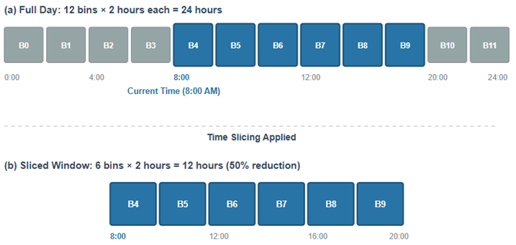

# DRL Solver for Dynamic TSP with Time Slicing

> Master's Thesis — Anuradha Dissanayake  
> University of Hildesheim, Germany

A Deep Reinforcement Learning framework for solving the **Dynamic Travelling Salesman Problem (DTSP)** with time-dependent edge costs and a novel **time-slicing** mechanism. Built on top of an attention-based transformer, extended with Cost-Aware Gating, Step-MLP temporal context, and two architectural variants for graph-independent and graph-dependent feature encodings.

<p align="center">
  
</p>

---

## Table of Contents

- [Overview](#overview)
- [Problem Formulation](#problem-formulation)
- [Key Contributions](#key-contributions)
- [Architecture](#architecture)
- [Model Variants](#model-variants)
- [Results](#results)
- [Repository Structure](#repository-structure)
- [Installation](#installation)
- [Usage](#usage)
- [Hyperparameter Tuning](#hyperparameter-tuning)
- [Citation](#citation)
- [Acknowledgements](#acknowledgements)
- [License](#license)

---

## Overview

Classical TSP solvers assume static edge costs. In real-world routing problems such as urban logistics, ride-hailing, and delivery fleets, travel times fluctuate throughout the day. This work addresses the **Dynamic TSP**, where edge costs (travel times) evolve as a function of time according to time-dependent distance matrices derived from real traffic data.

The solver adapts the attention-based RL framework of Kool et al. (2019) with three novel modules:

| Module | What it does |
|---|---|
| **Time Slicing** | Partitions the planning horizon into windows; re-encodes the graph at window boundaries |
| **Cost-Aware Gating** | Blends learned policy logits with heuristic signals via a learnable λ parameter |
| **Step-MLP** | Injects temporal context (step ratio, time encodings, tour statistics) into the decoder |

---

## Problem Formulation

<p align="center">
  
</p>

Given a set of *n* cities and a time-dependent distance matrix *d(i, j, t)* (modelled via cubic spline interpolation over CSV data), the agent must find a tour that minimises total travel time. Edge costs are bounded to [5%, 500%] of their baseline value and vary continuously with time.

The benchmark dataset covers **19** and **49** city instances drawn from a real location map:

<p align="center">
  
  &nbsp;&nbsp;
  
</p>

---

## Key Contributions

### 1 — Time Slicing

The planning horizon is divided into *W* equal-width windows. Before each window boundary the transformer re-encodes all unvisited nodes using the *current* distance matrix, giving the policy an up-to-date graph representation without restarting the episode.

<p align="center">
  
</p>

**Window size sensitivity** — smaller windows (more frequent re-encodings) reduce tour cost at the expense of inference time:

<p align="center">
  
</p>

### 2 — Cost-Aware Gating

A learnable scalar λ blends the policy's log-probabilities with a heuristic signal (nearest-neighbour, linear-time, etc.):

```
logits_final = logits_policy + λ · logits_heuristic
```

λ sensitivity across heuristic types:

<p align="center">
  
</p>

### 3 — Step-MLP Temporal Context

A small MLP injected into the decoder that receives features derived from the current decoding step:

- Step ratio (fraction of tour completed)
- Visited/unvisited node means
- Last 3 visited nodes
- Sin/cos time encoding
- Depot distance, running tour length

**Decoder variants** (pre-attention vs. post-attention MLP):

<p align="center">
  
</p>

---

## Architecture

<p align="center">
  
</p>

The encoder is a multi-head attention transformer. The decoder autoregressively selects the next city at each step using masked attention over unvisited nodes. Time slicing triggers encoder refresh at window boundaries; the Step-MLP and Cost-Aware Gating operate inside the decoder at every step.

---

## Model Variants

| Directory | Description |
|---|---|
| `m1/` | **Graph-independent** — node features do not include pairwise distance encoding. Faster, lower memory. |
| `m1_graph_dependent/` | **Graph-dependent** — encoder receives the current distance matrix as additional node features. More expressive, higher compute. |
| `m2/` | Experimental alternative architecture. |

Both `m1` and `m1_graph_dependent` share the same training interface (`train.py`, `options.py`); switch between them by pointing to the respective directory.

---

## Results

**Validation cost curves — baseline vs. TempMLP:**

<p align="center">
  
</p>

**Hyperparameter sensitivity:**

<p align="center">
  
</p>

**Inference efficiency (cost vs. wall-clock time):**

<p align="center">
  
</p>

---

## Repository Structure

```
DRLSolver4DTSPTimeSlicing/
│
├── m1/                              # Graph-independent model
│   ├── train.py                     # Training entry point
│   ├── test.py                      # Evaluation & model comparison
│   ├── transformer.py               # Encoder + decoder (attention model)
│   ├── options.py                   # All hyperparameters and flags
│   ├── baselines.py                 # REINFORCE baselines (rollout, critic, exponential)
│   ├── heuristics.py                # Nearest-neighbour, greedy-edge, two-opt, etc.
│   ├── experiment_tracker.py        # CSV-based experiment logging
│   ├── evaluate_step_mlp.py         # Step-MLP ablation evaluation
│   ├── visualize_experiments.py     # Plot experiment results
│   └── analyze_time_slicing_experiments.py
│
├── m1_graph_dependent/              # Graph-dependent model (same interface as m1)
│   ├── ...                          # Same structure as m1
│   ├── eval_heuristics.py           # CPU heuristic evaluation
│   ├── eval_heuristics_GPU.py       # GPU heuristic evaluation
│   └── time_inference.py            # Inference timing benchmarks
│
├── m2/                              # Experimental model 2
│
├── data/                            # All input data
│   ├── node_19.txt                  # City coordinates (19-city benchmark)
│   ├── node_49.txt                  # City coordinates (49-city benchmark)
│   ├── valid_data_19.txt            # Validation instances (19 cities)
│   ├── valid_data_49.txt            # Validation instances (49 cities)
│   ├── valid_data_49_v2.txt         # Validation instances (49 cities, v2)
│   └── generate_node_dataset.py     # Dataset generation script
│
├── results/                         # All experimental outputs
│   ├── comparison/                  # Model comparison results (costs, routes, xlsx)
│   ├── heuristics/                  # Heuristic baseline costs and summaries
│   ├── validation/                  # Validation cost curves (CSV + plots)
│   ├── timing/                      # Inference timing benchmarks (xlsx)
│   └── logs/                        # Experiment tracking logs (CSV)
│
├── docs/                            # Papers and documentation
│   ├── Thesis Report_Anuradha_Dissanayake.pdf
│   ├── PPT.pdf
│   ├── Anuradha_Dissanayake_Thesis_Proposal_V2.pdf
│   └── DECODER_DOCUMENTATION.docx
│
├── figures/                         # Architecture diagrams and result figures
│
├── scripts/                         # Utility scripts
│   ├── check_torch_env.py           # Verify PyTorch environment
│   ├── plot_spline.py               # Plot distance spline curves
│   └── test_direct_local.sh         # Local end-to-end test runner
│
├── requirements.txt
├── .gitignore
└── README.md
```

---

## Installation

**Requirements:** Python 3.8+, Windows or Linux, CUDA optional (DirectML supported on Windows)

```bash
# Clone the repository
git clone https://github.com/YOUR_USERNAME/DRLSolver4DTSPTimeSlicing.git
cd DRLSolver4DTSPTimeSlicing

# Create and activate a virtual environment
python -m venv .venv
# Windows:
.\.venv\Scripts\Activate.ps1
# Linux/macOS:
source .venv/bin/activate

# Install dependencies
pip install --upgrade pip
pip install -r requirements.txt
```

> **Windows GPU note:** The project uses `torch-directml` for GPU acceleration on Windows AMD/Intel/NVIDIA via DirectML. If you are on Linux with CUDA, replace `torch-directml` with the appropriate CUDA-enabled PyTorch wheel from [pytorch.org](https://pytorch.org/get-started/locally/).

---

## Usage

All commands below use `m1/` (graph-independent). Substitute `m1_graph_dependent/` to use the graph-dependent variant.

### Training

**Baseline model (rollout, 19 cities, 100 epochs):**
```bash
python m1/train.py --baseline rollout --graph_size 19 --n_epochs 100 --run_name baseline_model
```

**With Cost-Aware Gating + Step-MLP:**
```bash
python m1/train.py \
  --baseline rollout --graph_size 19 --n_epochs 100 \
  --run_name gating_nn_stepmlp \
  --use_cost_aware_gating --heuristic_type nearest_neighbor --lambda_heuristic 1.0 \
  --use_step_mlp --step_mlp_dim 64
```

**With Time Slicing (window size W=3):**
```bash
python m1/train.py \
  --baseline rollout --graph_size 19 --n_epochs 100 \
  --run_name time_slicing_w3 \
  --time_slicing --slicing_window 3
```

### Evaluation

**Evaluate a trained model:**
```bash
python m1/test.py \
  --load_path outputs/tsp_19/baseline_model_<timestamp>/epoch-99.pt \
  --graph_size 19 --baseline rollout
```

**Compare two models side-by-side:**
```bash
python m1/test.py \
  --graph_size 19 --baseline rollout \
  --compare_models \
    outputs/tsp_19/baseline_<ts>/epoch-99.pt \
    outputs/tsp_19/gating_<ts>/epoch-99.pt \
  --compare_names "Baseline" "MLP+Gating"
```

**Run heuristic baselines:**
```bash
python m1_graph_dependent/eval_heuristics.py --graph_size 19
```

---

## Hyperparameter Tuning

**Lambda sweep (Cost-Aware Gating):**
```bash
for lambda_val in 0.1 0.5 1.0 2.0 5.0; do
    python m1/train.py --baseline rollout --graph_size 19 --n_epochs 50 \
        --run_name gating_linear_lambda_${lambda_val} \
        --use_cost_aware_gating --heuristic_type linear_time \
        --lambda_heuristic ${lambda_val}
done
```

**Window size sweep (Time Slicing):**
```bash
for w in 3 6 9 12; do
    python m1/train.py --baseline rollout --graph_size 19 --n_epochs 50 \
        --run_name time_slicing_w${w} \
        --time_slicing --slicing_window ${w}
done
```

All runs are automatically logged to `outputs/tsp_<size>/<run_name>_<timestamp>/` and tracked in `experiment_log.csv`.

---

## Citation

If you use this code or build on this work, please cite:

**Thesis:**
```bibtex
@mastersthesis{dissanayake2026dtsp,
  title   = {Solving the Dynamic Travelling Salesman Problem with Deep Reinforcement Learning and Time Slicing},
  author  = {Dissanayake, Anuradha},
  school  = {Hochschule f{\"u}r Technik und Wirtschaft Berlin},
  year    = {2026}
}
```

**Original paper this work extends:**
```bibtex
@article{zhang2021solving,
  title     = {Solving Dynamic Traveling Salesman Problems With Deep Reinforcement Learning},
  author    = {Zhang, Zizhen and Liu, Hong and Zhou, MengChu and Wang, Jiahai},
  journal   = {IEEE Transactions on Neural Networks and Learning Systems},
  year      = {2021},
  publisher = {IEEE},
  doi       = {10.1109/TNNLS.2021.3105905}
}
```

---

## Acknowledgements

- Base attention model adapted from [wouterkool/attention-learn-to-route](https://github.com/wouterkool/attention-learn-to-route)
- Zhang et al. (2021) for the DTSP-DRL baseline this work extends
- HTW Berlin for institutional support

---

## License

This project is released for academic and research use. See [LICENSE](LICENSE) for details.
